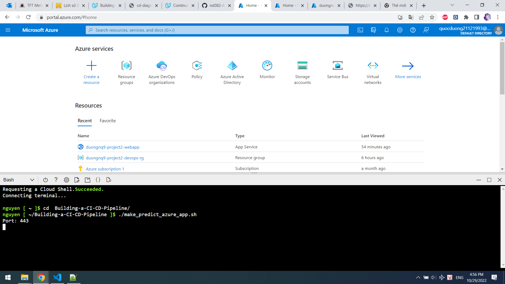

[](https://github.com/quocduongnguyen/Building-a-CI-CD-Pipeline/actions/workflows/main.yml)

# Overview
In this project, I will build a Github repository from scratch and create a scaffolding that will assist you in performing both Continuous Integration and Continuous Delivery. I will use Github Actions along with a Makefile, requirements.txt and application code to perform an initial lint, test, and install cycle. Next,  I will integrate this project with Azure Pipelines to enable Continuous Delivery to Azure App Service.

## Project Plan
* A [link](https://trello.com/b/ZuxaG9er/building-a-ci-cd-pipeline) to a Trello board for the project
* A [link](Project%202%20DevOps%20Worksheet.xlsx) to a spreadsheet that includes the original and final project plan>

## Instructions
* Architectural Diagram


* Project running on Azure App Service


* Project cloned into Azure Cloud Shell

Open Bash in Azure


Create SSH Key by run: 
```
ssh-keygen -t rsa
```


Run:
```
cat /home/nguyen/.ssh/id_rsa.pub
```
to show SSH key. Copy this key and add to my repo


Run: 
```
git@github.com:quocduongnguyen/Building-a-CI-CD-Pipeline.git
```
to clone my repo


* Passing tests that are displayed after running the `make all` command from the `Makefile`
Access to Building-a-CI-CD-Pipeline folder:
```
cd Building-a-CI-CD-Pipeline/
```
run `make all` to setting environment and run test

* Output of a test run


* Successful deploy of the project in Azure Pipelines.  [Note the official documentation should be referred to and double checked as you setup CI/CD](https://docs.microsoft.com/en-us/azure/devops/pipelines/ecosystems/python-webapp?view=azure-devops).


* Running Azure App Service from Azure Pipelines automatic deployment


* Successful prediction from deployed flask app in Azure Cloud Shell.  [Use this file as a template for the deployed prediction](https://github.com/udacity/nd082-Azure-Cloud-DevOps-Starter-Code/blob/master/C2-AgileDevelopmentwithAzure/project/starter_files/flask-sklearn/make_predict_azure_app.sh).
The output should look similar to this:


```bash
udacity@Azure:~$ ./make_predict_azure_app.sh
Port: 443
{"prediction":[20.35373177134412]}
```

* Output of streamed log files from deployed application
```
az webapp log tail -g duongnq9-project2-devops-rg --name duongnq9-project2-webapp
```

> 

## Enhancements

<TODO: A short description of how to improve the project in the future>

## Demo 

<TODO: Add link Screencast on YouTube>


